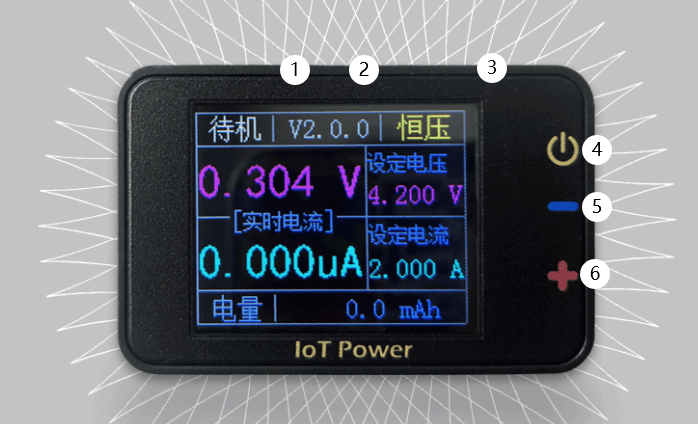

# 🔋 IoT Power - 经典

## 概述

IOT Power是一款功能齐全，稳定可靠的小型手持式功率计。它可以通过USB C供电，输出电压与最大电流均可自由调节，独立输出最高达5V2A，是广大用户随身携带的理想测试工具。

## 技术特性

- 最大输出范围：电压最大5V，电流最大2A（需要供电满足要求）
- 使用0.4% 精度基准芯片，0.1%精度精密电阻，12位ADC设计，标称精度1%
- 自动测量范围：电流回显档位分别为200μA、2mA、200mA、2A四个档位，根据当前输出电流自动切换（除200μA档需手动进入），12位ADC
- 档位切换速度：自动档位切换速度≥40us
- 电流测量精度：200μA档位时分辨率0.5μA，2mA档位时分辨率1μA(下表)
- 10KHz采样速率，USB高速数据传输
- 可配合PC客户端查看与分析电流波形，也可使用命令行版本在任意设备(win/linux/mac)上抓取串口数据（如树莓派），使用pc客户端导入查看

## 技术指标

|类型|范围|分辨率|标称精度|实际精度|
|:-:|:-:|:-:|:-:|:-:|
|电压设定|0V-5V|1mV|1%|<0.5%|
|电压回读|0V-5V|1mV|1%|<0.5%|
|电流设定|0-2mA|1μA|1%|<0.5%|
|电流设定|0-2A|1mA|1%|1%|

|电流量程|范围|分辨率|标称精度|实际精度|类型|
|:-:|:-:|:-:|:-:|:-:|:-:|
|200μA|0-200μA|0.5μA|1%|<0.5%|手动档位|
|2mA|200μA-2mA|1μA|1%|<0.5%|自动档位|
|200mA|2mA-200mA|1mA|1%|<1%|自动档位|
|2A|200mA-2A|10mA|1%|<1%|自动档位|

## 注意事项

- IOT Power的输出最高电压和电流，受限于USB输入端的电压和电流，如果输入端电压和电流小于5.5V/2A，输出最高电压和电流时会跌落（请勿向USB口提供超出5.8V的高电压）
- 受限于体积，IOT Power在输入输出压差大、同时电流大时，发热量较大，所以建议勿长时间超过1.2A电流使用

```{warning}
⚠警告：输出端短路、输入端或输出端浪涌，将可能损坏设备。请勿进行短路与其他风险操作

⚠风险提示：部分品牌快充充电头（如华为、小米等私有协议快充头）可能会误识别快充协议，导致向设备提供超过5.8V的高电压导致瞬间烧毁设备。建议尽量不要使用快充充电头
```

## 设备结构



|序号|短按|长按|滚动|
|:-:|:-:|:-:|:-:|
|**①**|光标左移|清除底电流||
|**②**|光标右移|进入200μA档||
|**③**|切换调节位置|切换A/mA|调整数值或切换模式|
|**④**|打开或关闭电源输出|打开充电输出模式||

**⑤** ：电源输出负极
**⑥** ：电源输出正极

## 使用说明

### 更改电压

短按下③多次，让光标停留在**设定电压**位置，使用①、②移动光标至需要修改的位置，滚动③调节数值。电压在没有负载时因为回路不闭合所以显示是不准的，请连接负载使用，未连接负载时显示的值是不可靠的。

### 更改最大电流

短按下③多次，让光标停留在**设定电流**位置，长按③可切换**mA**与**A**单位，使用①、②移动光标至需要修改的位置，滚动③调节数值

### 开启或关闭输出

当左上角显示**待机**时，表示未输出；短按④可切换到**正常**模式，表示正在输出；再短按④可回到**待机**模式。在**待机**模式时，长按④可开启充电输出模式。

### 调零

在保证外部没有连接任何设备的前提下，短按④切换到**正常**模式，打开输出；再长按①设置当前底电流，即可调零

### 切换电量与功率显示

短按下③多次，让光标停留在**电量**或**功率**位置，滚动③更改模式

### 进入200μA档位

当**保证输出电流不大于200μA时**，长按②进入200μA档位。
注意：当电流大于200μA后，会自动退出200μA档位

### 固件升级

在客户端内点击升级即可；如需强制升级，可以前往设置选项卡强制升级
**特别提醒：每台机器都有各自的校准参数，请勿擦除，否则后果自负。**

## 常见问题

### 什么是恒压模式和恒流模式

顾名思义，恒压就是稳压输出（禁止短路），恒流是稳流输出（开路无效）。本电源为了方便恒压模式和恒流模式是自动竞争机制。接近预设恒流值的时候竞争，达到预设恒流值时恒流，其他时间恒压输出。通常恒压输出的时候，为了防止负载短路发生意外，会预设恒流值，建议是正常负载峰值电流的2倍。

### 恒压模式下电流值比实测值偏小

请检查预设值的恒流值是否偏小，当预设恒流值接近当前电流值的时候，恒流和恒压模式处于竞争状态导致实际测量电流值偏小。

### 未连接耗电设备时，设备显示的当前电压比设定的电压要高

IotPower 静态输出是高阻抗，不会主动对负载端的电量进行泄放，这有助于提高测量的精度。正常连接任意耗电器件后即可降至目标电压（用手摸摸也会降）

### 接语音功放芯片等，声音会打嗝

这个与前一个问题类似，语音是正弦波，峰值电流是平均电流的4倍以上，所以预设恒流值建议取4倍以上。

### 设定5V输出，实际输出不稳定，电流也不稳定

因为USB是5V输出，大部分电脑或适配器输出是5V ±5% 的电压，输入5V是无法恒压5V输出的。解决办法是：用带线损补偿的5V适配器，或将输出电压调低到4.8V即可。

### 我想外接USB输出，有方案吗

我们提供输出端转usb母座转接板工程，可以进群查看群共享

### 负载从大电流切换到uA电流时，输出电压升高

正常现象，真实电路有寄生电感，电流突变会在寄生电感上产生感应电压叠加到输出。为了能精确测量μA电流，iotpower并没有像普通稳压电源使用功率电阻和大电容做假负载，故表现出电路的真实情况。IotPower 静态输出是高阻抗，不会主动对负载端休眠或者关机后的电量进行泄放，可以更真实的模拟电池供电环境。

## 常见故障维修

### 拨码滚动不流畅或按下后无法弹起

将背板三四个螺丝稍微松动一些即可解决。

### 电压输出始终为5V

通常该现象发生在设备输出端短路后，可以拆机更换Q2处的MOS管，可在立创购买替换器件：[立创商城](https://item.szlcsc.com/905902.html)

```{warning}
拆机时注意！

请先拆下四个螺丝

小心拆掉背板（有导热胶与pcb相连）

拆除pcb底板，**注意不要损坏拨轮**

最后拆下屏幕（若无必要可以不拆屏）
```

### 没有电压输出

通常该现象发生在设备输出端被反向大电流烧毁后，比如外接了高于5v电压的电池等设备。可以手动尝试更换运放（sop封装的那个），型号为RS8554。

### 黑屏无输出有烧焦气味

通常该现象发生在设备被usb供电端大电流烧毁后，比如连接了快充充电头，充电头错误输出了快充电压，导致供电高于设备的5.8V耐压。该情况较难修理，有可能烧毁CP2102、DCDC调压与LDO部分，建议不要对修复抱有太大希望，换个新的吧反正也不贵。
