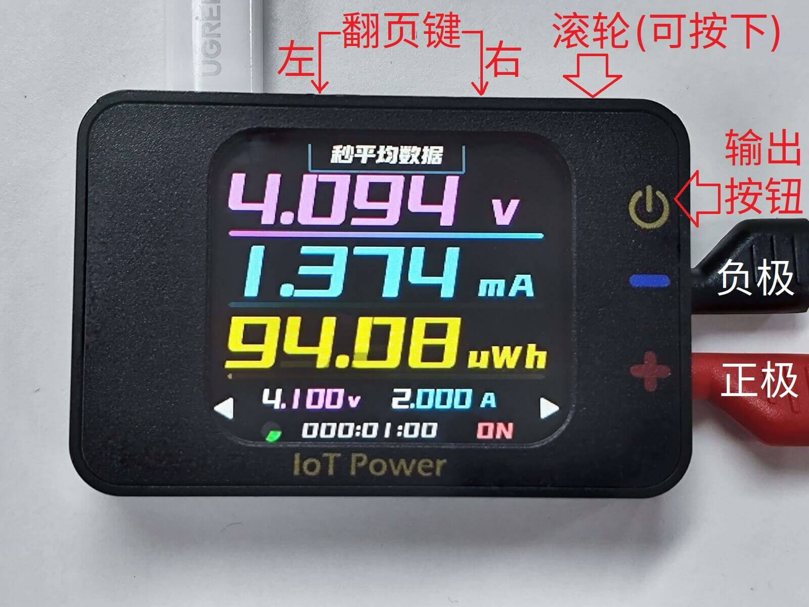

# 连接与外观

## 布局与功能

设备基本外观如下



|   操作   |       普通模式       |        编辑模式        |
| :------: | :------------------: | :--------------------: |
| 左翻页键 |   切换到左边的页面   | 切换到左边的一位数字上 |
| 右翻页键 |   切换到右边的页面   | 切换到右边的一位数字上 |
| 滚动滚轮 | 切换页面中选中的控件 |   调整选中数字的数值   |
| 按下滚轮 | 进入或切换选中的控件 |      退出编辑模式      |
| 输出按钮 |  开启或关闭电源输出  |          同左          |

输出端连接附赠的香蕉头转鳄鱼夹线缆

```{warning}
⚠风险提示  
部分品牌快充充电头（如华为、小米等私有协议快充头）可能会误识别快充协议，导致向设备提供超过5.8V的高电压导致瞬间烧毁设备。  
建议尽量不要使用此类充电头连接设备的PC通讯电源接口  
PC通讯接口，严禁正负反接或电压大于6V，反接或大于6V必烧！
```

```{warning}
⚠警告  
电源输出接口，严禁反接其他电源/电池，或连接5V以上电压的其他电源/电池，以免烧毁设备。
```

## 供电方式

IOT Power Pro支持通过TypeC口进行供电

## 输出方式

设置好电压与电流后（方式参考下一页面），按下输出按键，即可开启输出。

<script>
if (navigator.language.indexOf("CN") < 0 && confirm ("Are you want to switch to English version of this page?")) {
    window.location.href = "tech-en.html";
}
</script>
