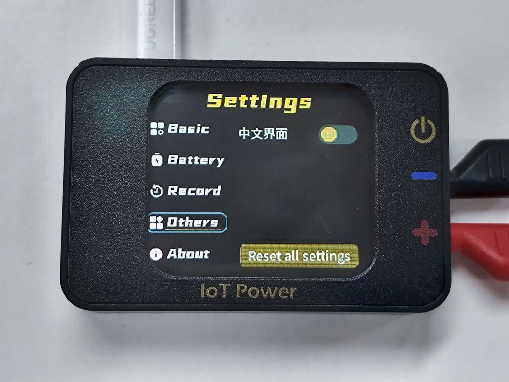
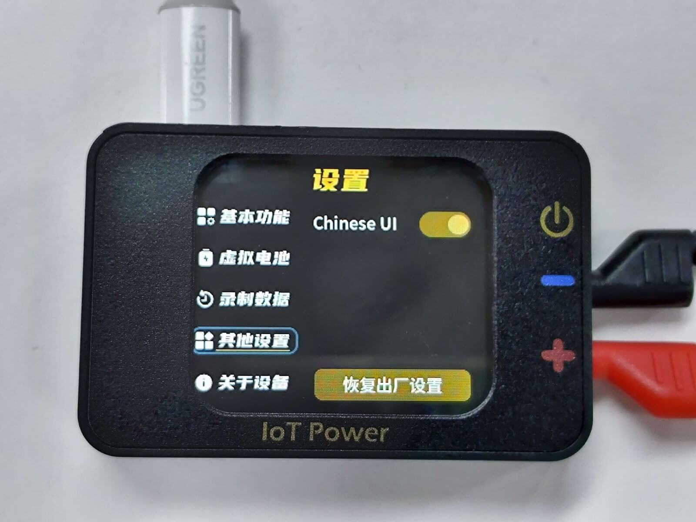
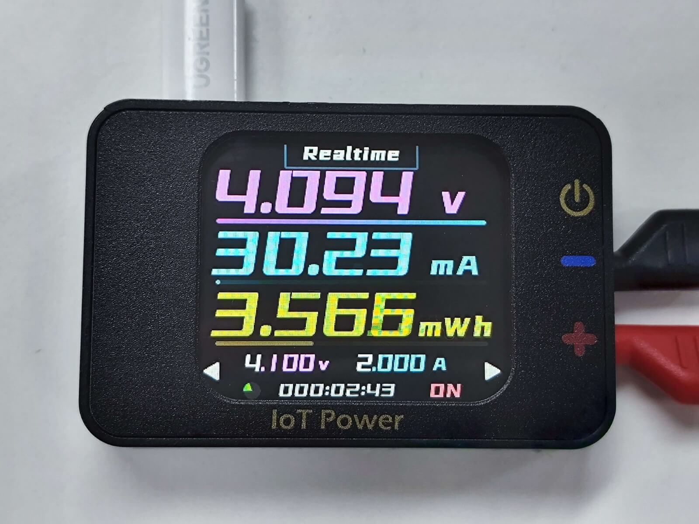
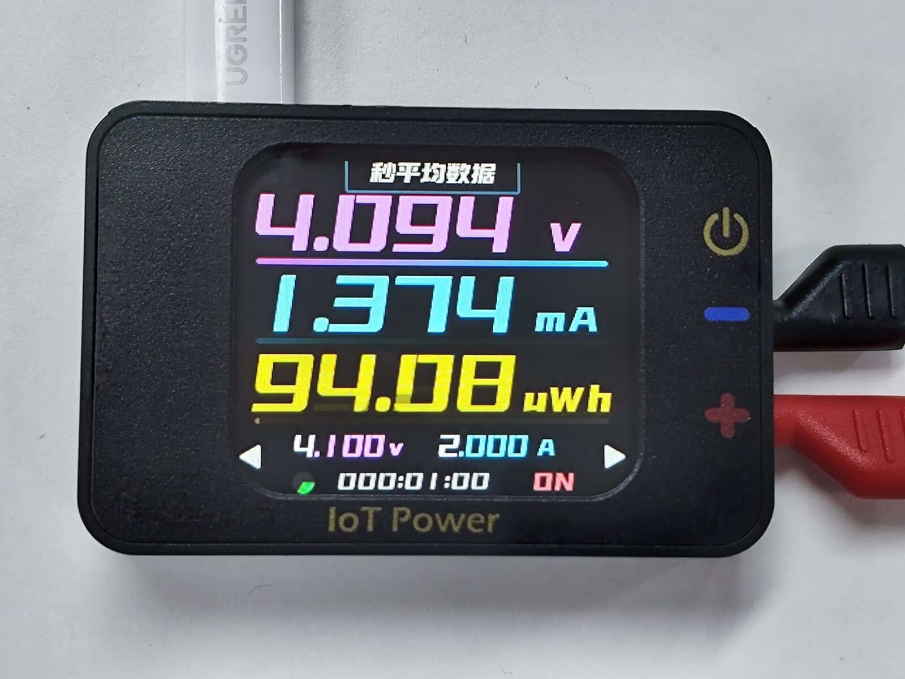
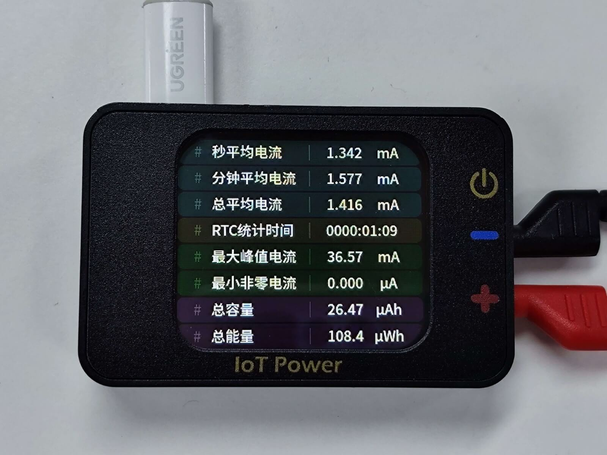
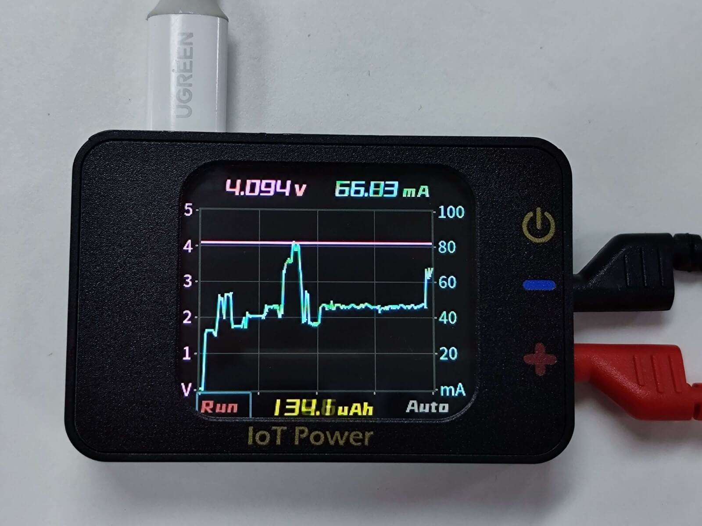
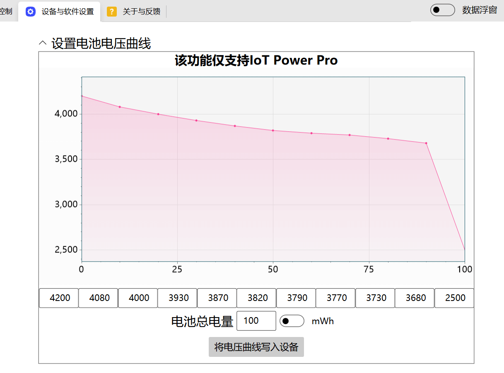
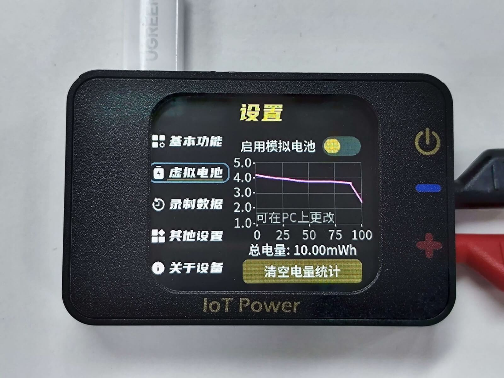
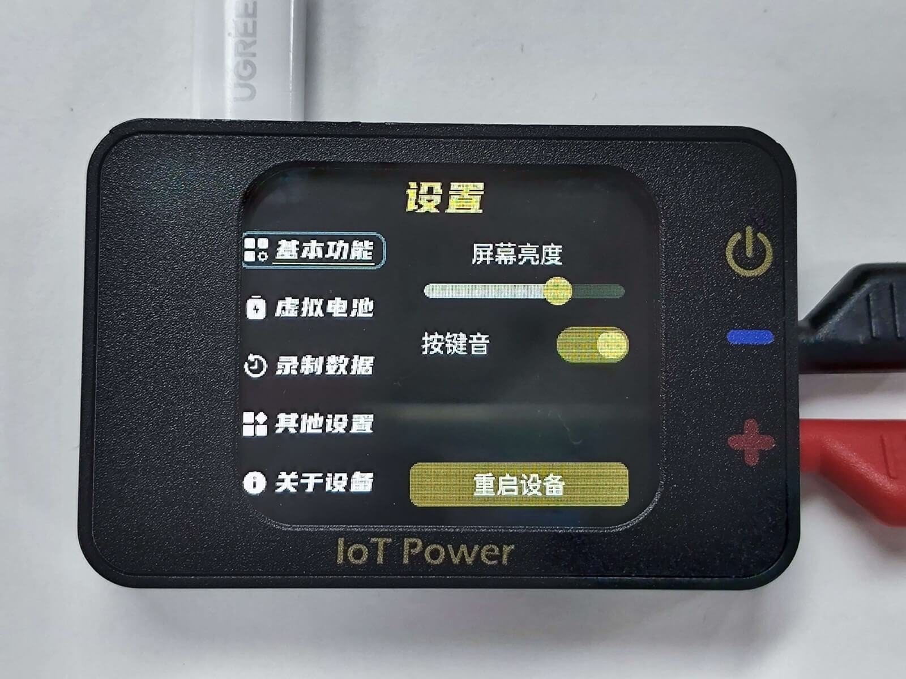

# 操作说明

该部分内容将讲解设备各部分功能的具体含义与按键操作方式

设备支持中英文双语切换，可参考下方的设置项更改语言。

:::{dropdown} 切换语言
（设备默认中文，可更改语言）

切换到设置页面--其他设置(Others)，修改语言




修改后切换页面即可立即生效


:::

```{warning}
⚠风险提示  
PC通讯接口，严禁反接或电压大于6V，反接或大于6V必烧！  
电源输出接口，严禁反接其他电源/电池，或连接5V以上电压的其他电源/电池，乱接设备必烧！
```

## 基本操作

### 翻页

按下**翻页键**，可向前后页面翻页

### 选择控件与操作

滚动**滚轮**键可切换选中的控件，按下可操作选中的控件

部分控件按下后会进入该控件，此时**滚轮**键可更改该控件的值，再次按下后退出修改

## 输出供电



```{note}
电压值下方的进度条，表示当前电压值占设置电压值的占比  
电流值下方的进度条，表示当前电流值占设置电流值的占比  
电量/功率值下方的进度条，表示当前耗电量占设置模拟电池电量的占比
```

### 修改电压

在该页面，使用**滚轮**，选中下方的电压值`4.100v`，按下**滚轮**即可进入编辑模式；  
**翻页键**可更改选中的数字，**滚轮**键可更改这一位数字的值；  
再次按下**滚轮**键即可退出更改

### 修改电流

在该页面，使用**滚轮**，选中下方的电流值`2.000A`，按下**滚轮**即可进入编辑模式；  
**翻页键**可更改选中的数字，**滚轮**键可更改这一位数字的值；  
再次按下**滚轮**键即可退出更改

选中电流值边上的`A`或`mA`，按下**滚轮**可切换`A`或`mA`的单位

### 开启和关闭输出

按下**输出按钮**即可开启或关闭电源输出

### 查看秒平均数据

使用**滚轮**，选中最上方的`实时数据`，按下**滚轮**即可切换至秒平均显示

### 切换W、Wh、Ah

使用**滚轮**，选中第三行黄色数据后的单位，按下**滚轮**即可切换W、Wh、Ah显示

## 查看详细数据



在该页面可查看详细数据

## 查看波形



在该页面可查看电压电流波形

### 暂停波形刷新

使用**滚轮**，选中下方的`Run`，按下**滚轮**即可暂停波形打印，此时文字变为`Stop`；  
再次按下**滚轮**可重新开启波形刷新

### 切换电流坐标范围

使用**滚轮**，选中下方的`Auto`，按下**滚轮**即可切换电流坐标范围，此时文字变为`Fixed`；  
可多次按下**滚轮**来切换不同的固定坐标，切换数次后可恢复自动坐标范围功能。

### 切换下方数据的W、Wh、Ah

使用**滚轮**，选中下方中间黄色数据后的单位，按下**滚轮**即可切换W、Wh、Ah显示

## 模拟电池

设备可模拟电池，可模拟电压下降波形与容量，输出时将根据耗电量自动更改输出电压，并在电量耗尽时关闭输出。

### 修改电池电压曲线与电量

将设备通过USB连接至PC，打开IoT Power客户端，连接设备，切换至`设置页面`，修改模拟电池相应的参数并更新到设备中：



### 开启模拟电池功能



可在设置页面查看当前的电池设置信息  
使用**滚轮**，选中`启用模拟电池`，按下**滚轮**即可切换模拟电池功能的开启与关闭  
开启该功能后，首屏的电压设置功能将被禁用，电压设置位置将显示为`BATT`

## 设置



该页面可进行各项设置，可以按需修改
