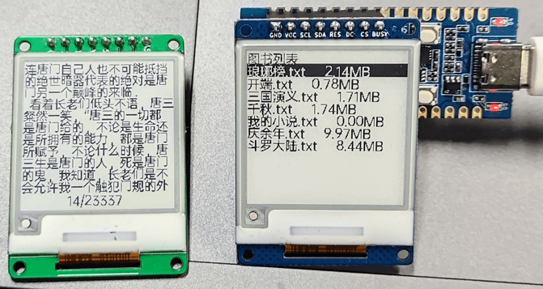
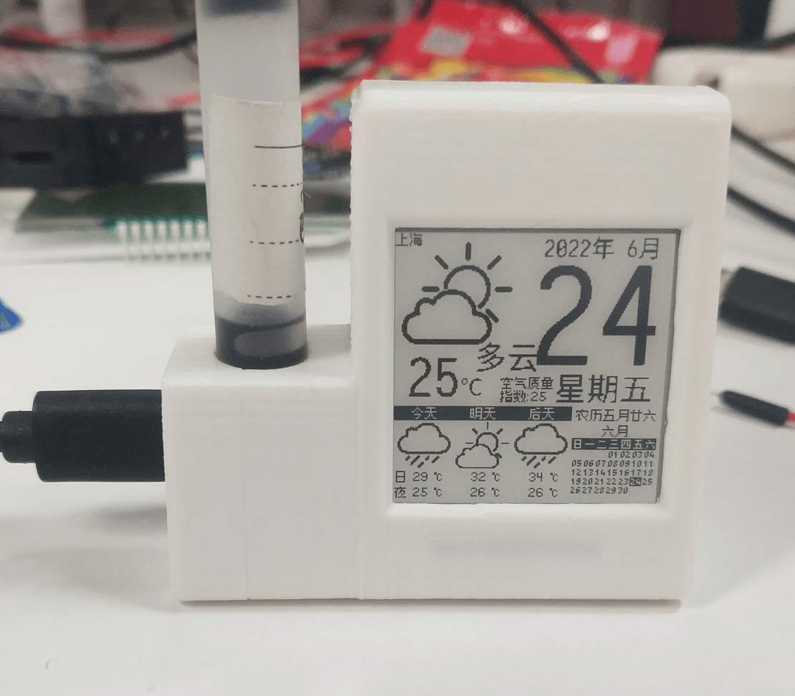

# 使用示例

## demo例子

参考LuatOS主仓库的[Eink demo](https://gitee.com/openLuat/LuatOS/tree/master/demo/eink/Air101)，注意该屏幕的驱动应使用`eink.MODEL_1in54`。

> 注意：由于墨水屏的`BUSY`引脚对应`ESP32C3-CORE`开发板的`GPIO11`，所以如果使用的是`ESP32C3-CORE`开发板，**需要[进行解锁操作](https://wiki.luatos.com/chips/esp32c3/board.html)才可正常使用该屏幕**。

## 项目例子

### 电纸书

项目地址：[https://gitee.com/HashJeremy/EinkBook-LuatOS](https://gitee.com/HashJeremy/EinkBook-LuatOS)

### 墨水屏日历

项目地址：[墨水屏接口说明](https://api.luatos.org/#eink)

外壳模型：[3d文件](https://cdn.openluat-luatcommunity.openluat.com/attachment/20220710142131642_外壳.7z)，由群友好记星设计
